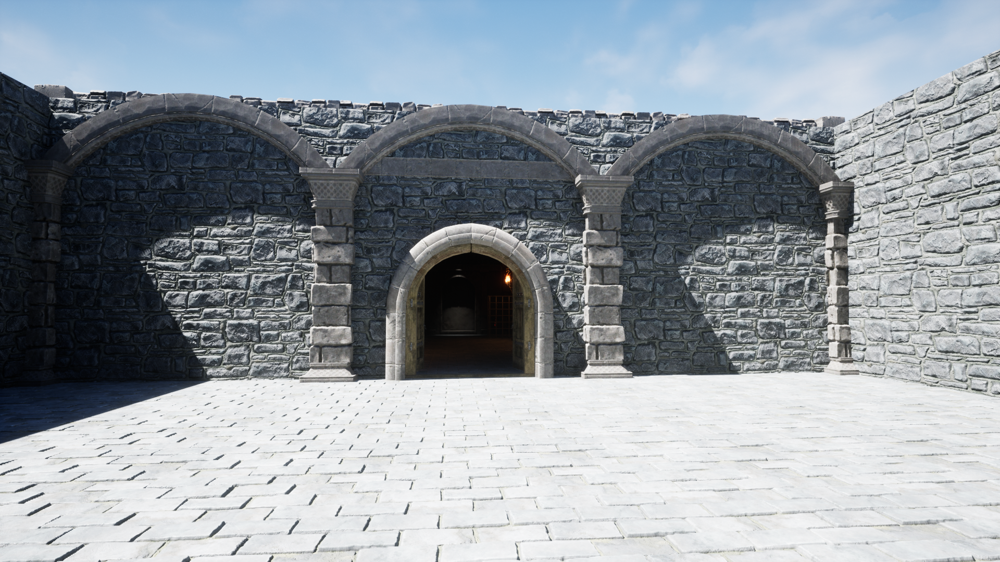
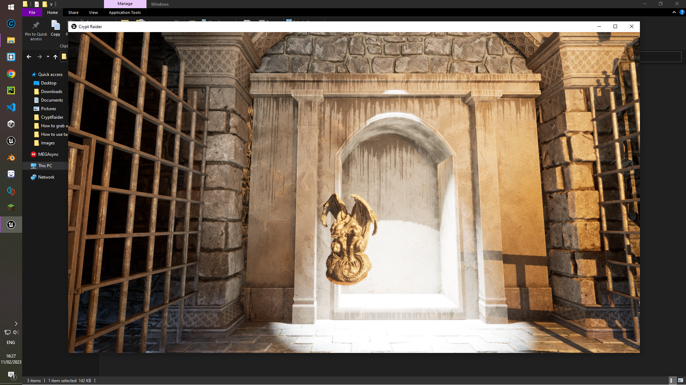
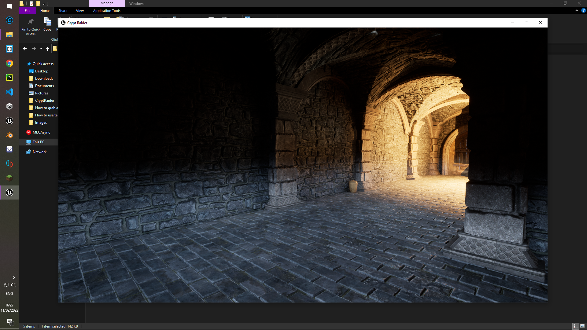

<!-- GAME PROJECT TITLE -->
# CryptRaider---Game
Game created for study purposes by Matheus Soares Martins, and is was created to test first-person features, and programming using C++. 
This game is a mystery puzzle game that you have to walk through it and discover how to steal the golden statue.
 

This game was made to be played by one player, and it uses the commonly used input for games.
 

Player controls 
W or Up Arrow - Goes to the front 
A or Left Arrow - Goes to the left 
S or Down Arrow - Goes into the back direction 
D or Right Arrow - Goes to the right 
Spacebar - Makes the character jump 

Other controls 
F11 - Toggle between fullscreen and windowed mode. 
******************************************************************************

 

# Screenshots
<!-- GAME PROJECT IMAGES -->

# <!-- GAME PROJECT BUILDS -->
# Game download 
## Windows: https://mega.nz/folder/oQtRmaIJ#gDCkXxoZLt6jq02pyogatg